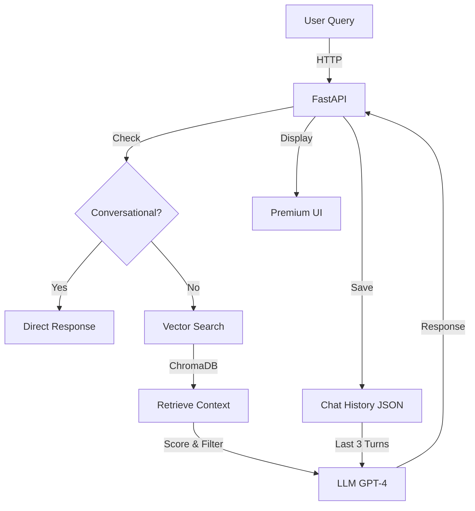

# Mysoft Heaven AI Chatbot 🤖

A production-ready **RAG (Retrieval-Augmented Generation)** chatbot designed for Mysoft Heaven (BD) Ltd. This AI assistant provides accurate, company-specific information by strictly answering from a curated knowledge base.


---
## UI 
 
 
 

## 🎯 Features

- **RAG-Powered Responses** - Answers strictly from company documents
- **Multi-Language Support** - Supports English and Bangla
- **Conversation Memory** - Maintains context from last 3 conversation turns
- **Confidence Scoring** - Logs similarity scores for quality monitoring
- **Conversational AI** - Handles greetings and common queries naturally
- **Premium UI** - Modern glassmorphic design with animations
- **Docker Ready** - Full containerization support
- **Render Deployment** - One-click cloud deployment

---

## 🏗️ Architecture

### Tech Stack

| Component | Technology |
|-----------|-----------|
| **Backend Framework** | FastAPI |
| **LLM** | OpenAI GPT-4 Turbo (with fallback) |
| **Embeddings** | Hugging Face `all-MiniLM-L6-v2` (local, free) |
| **Vector Database** | ChromaDB |
| **Orchestration** | LangChain |
| **Frontend** | HTML, CSS, JavaScript |
| **Proxy** | Nginx |
| **Deployment** | Docker, Render |

### System Diagram



---

## 📊 Data Collection & Preprocessing

### Data Scraping (Pre-processing)

**Original Data Collection:**
The company data was scraped from the Mysoft Heaven website using:
- **BeautifulSoup4** - HTML parsing and extraction
- **Requests** - HTTP requests to fetch web pages

**Scraping Process:**
1. Fetched company web pages (services, products, projects, etc.)
2. Extracted text content from HTML
3. Stored in Excel format with columns: `url`, `Path`, `content`

### Data Cleaning 

**Output:** Clean text ready for embedding

**Column Usage:**
- ✅ **content** - Used for RAG (after cleaning)
- ❌ **url** - Stored as metadata only
- ❌ **Path** - Stored as metadata only

**Why Clean?**
- Removes HTML artifacts that harm embedding quality
- Reduces noise in vector search results
- Improves semantic similarity matching

---

## 📚 RAG Pipeline Details


### 1️⃣ Document Chunking Strategy

**Approach:** Sentence-based chunking with overlap

- **Chunk Size:** 400 characters (optimal for dense information retrieval)
- **Overlap:** 100 characters (maintains context between chunks)
- **Method:** Splits by sentences, then groups to ~400 chars
- **Why?** Balances specificity with sufficient context for accurate retrieval

---

### 2️⃣ Embedding Model Choice

**Model:** `sentence-transformers/paraphrase-multilingual-MiniLM-L12-v2` (Hugging Face)

**Why this model?**
- ✅ **Free & Local** - No API costs
- ✅ **Fast** - 118M parameters, optimized for speed
- ✅ **Accurate** - 384-dimensional embeddings
- ✅ **Battle-tested** - 5M+ downloads on Hugging Face
- ✅ **Multi-language** - 50 + language 

**Alternative:** OpenAI `text-embedding-3-small` (if API key provided)

---

### 3️⃣ Handling Irrelevant Queries

**Multi-Layer Defense System:**

#### **Layer 1: Conversational Handler**
Detects greetings and basic questions without vector search
- "Hello", "Who are you?", "How are you?"
- Returns friendly, context-aware responses

#### **Layer 2: Vector Search**
Searches ChromaDB for relevant company information
- Retrieves top 3 most similar chunks
- Calculates similarity scores

#### **Layer 3: LLM Prompt Engineering**
System prompt enforces strict boundaries:
```
"You must answer questions strictly based on the provided context.
If the answer is not in the context, politely state that you don't know.
Do not use external knowledge."
```

**Example Rejection:**
```
User: "What is the weather today?"
→ No relevant chunks found
→ Response: "I'm sorry, I don't have information about that in my knowledge base."
```
---

### 4️⃣ Conversation Memory

**Format:** JSON file storage
**Location:** `app/database/chat_data.json`
**Format:**
```json
[
  {
    "user query": "What services do you provide?",
    "AI_response": "Mysoft Heaven provides..."
  }
]
```

**Memory Window:** Last **3 conversation pairs** (6 messages total)

**Why 3 pairs?**
- Sufficient context for multi-turn conversations
- Prevents token limit issues
- Balances memory vs freshness

---

### 5️⃣ Confidence-Based Responses

**Similarity Score Logging:**
Every query logs its similarity score (0-100%) to the terminal:

```
============================================================
QUERY: What government projects have you done?
SIMILARITY SCORE: 87.45%
CONTEXT FOUND: Yes
============================================================
```

**Fallback Messaging:**
- **No Context (0%):** Polite rejection message
- **Low Match (<40%):** "I don't have information about that..."
- **Good Match (40%+):** Proceeds with response generation

**Note:** No hard thresholds used - LLM decides if context is sufficient
---

## 🏢 Multi-Company Support (Future)

### Current Architecture Supports:

**1. Configurable Paths**
```python
# config.py - Can be parameterized per company
DATABASE_PATH = "data/chroma_db"           # → "data/company_a/chroma_db"
EXCEL_DATA_PATH = "data/company_data.xlsx" # → "data/company_a/data.xlsx"
CHAT_HISTORY_PATH = "app/database/chat.json" # → "app/database/company_a/chat.json"
```

**2. Metadata in Chunks**
Each chunk already includes:
```python
{
  "source": "mysoftheaven data.xlsx",
  "path": "/products/hr-software",
  "chunk_index": 42
}
```
**Benefits:**
- ✅ Isolated knowledge bases per company
- ✅ Separate conversation histories
- ✅ Company-specific branding
- ✅ Scalable to N companies

---
## 🚀 Getting Started

### Prerequisites

- Python 3.12+
- Docker (optional, for containerized deployment)
- OpenAI API Key (optional, uses fallback without it)

### Installation

```bash
# 1. Clone the repository
git clone <your-repo-url>
cd mysoft-ai-chatbot

# 2. Create virtual environment
python -m venv venv
venv\Scripts\activate  # Windows
# source venv/bin/activate  # Linux/Mac

# 3. Install dependencies
pip install -r requirements.txt

# 4. Configure environment
# Create .env file and add (optional):
OPENAI_API_KEY=your_api_key_here

# 5. Initialize vector database
python -m app.database.database

# 6. Run the application
uvicorn main:app --reload --host 0.0.0.0 --port 8000
```

### Access

Open your browser: **http://localhost:8000**

---

## 🐳 Docker Deployment

### Local Docker

```bash
# Build and run with Docker Compose
docker-compose up --build

# Access at http://localhost:8089
```

### Deploy to Render

1. **Push to GitHub**
2. **Connect Render to your repo**
3. **Render will auto-detect `render.yaml`**
4. **Add environment variable:**
   - Key: `OPENAI_API_KEY`
   - Value: Your OpenAI key
5. **Deploy!**

---

## 📁 Project Structure

```
mysoft-ai-chatbot/
├── app/
│   ├── chatbot_logic/          # RAG & LLM logic
│   │   ├── llm_service.py      # Main RAG service
│   │   ├── router.py           # FastAPI endpoints
│   │   └── chatbot_request.py  # Request/Response models
│   ├── Dtat_scrip/             # Data preprocessing
│   │   └── ectraction_service.py
│   └── database/               # Vector DB & chat history
│       ├── database.py         # ChromaDB manager
│       └── chat_data.json      # Conversation memory
├── data/
│   ├── mysoftheaven data.xlsx  # Source documents
│   └── chroma_db/              # Vector database (auto-generated)
├── templates/                  # Frontend UI
│   ├── index.html
│   ├── style.css
│   └── script.js
├── config.py                   # Central configuration
├── main.py                     # FastAPI app entry point
├── requirements.txt
├── Dockerfile
├── docker-compose.yml
└── README.md
```

---

## 🔧 Configuration

---

## 📊 API Endpoints

### `POST /api/chat`
**Description:** Send a chat message

### `POST /api/refresh-data`
**Description:** Re-index vector database from Excel

---

## 🎨 Features Showcase

✨ **Glassmorphic UI** - Modern, premium design  
🌐 **Multi-Language** - Auto-detects Bangla/English  
💬 **Contextual Memory** - Remembers last 3 conversations  
🔍 **Similarity Logging** - Monitor query quality  
🛡️ **Scope Protection** - Rejects out-of-domain queries  
⚡ **Fast Embeddings** - Local Hugging Face model  
📦 **Docker Ready** - Full containerization  

---

## 🤝 Contributing

Contributions are welcome! Please follow these steps:

1. Fork the repository
2. Create a feature branch (`git checkout -b feature/amazing-feature`)
3. Commit your changes (`git commit -m 'Add amazing feature'`)
4. Push to the branch (`git push origin feature/amazing-feature`)
5. Open a Pull Request

---

---
## 🙏 Acknowledgments

- LangChain for RAG orchestration
- Hugging Face for free embeddings
- ChromaDB for vector storage
- OpenAI for GPT-4 Turbo

---
